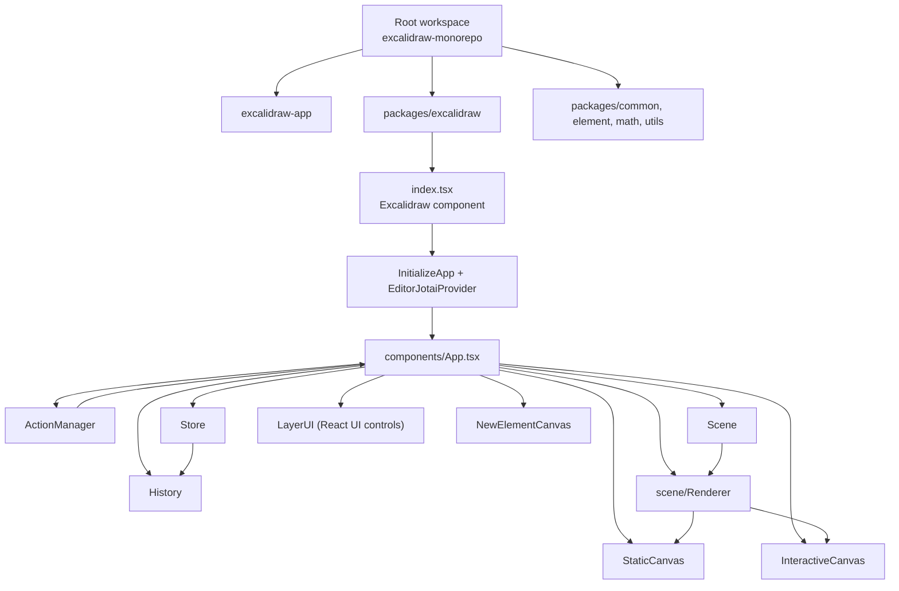

# Architecture

## High-level Architecture

This repository is a Yarn workspaces monorepo (`package.json` at root):

- Workspaces:
  - `excalidraw-app`
  - `packages/*`
  - `examples/*`
- Root scripts delegate build/start/test to workspace packages.

At runtime, the main editor package is `packages/excalidraw`.

Primary composition chain:

1. `index.tsx` exports `<Excalidraw />`.
2. `<Excalidraw />` wraps `components/App.tsx` with:
   - `EditorJotaiProvider`
   - `InitializeApp`
   - API contexts (`ExcalidrawAPIContext`, `ExcalidrawAPISetContext`).
3. `components/App.tsx` class orchestrates:
   - state (`AppState`)
   - scene (`Scene`)
   - store (`Store`)
   - history (`History`)
   - actions (`ActionManager`)
   - renderer (`Renderer`)
   - UI layer (`LayerUI`)
   - canvas layers (`StaticCanvas`, `InteractiveCanvas`, `NewElementCanvas`).

### Mermaid: high-level component architecture

## Data Flow between application components

### 1) Initialization flow

- `ExcalidrawBase` in `index.tsx` passes props into `App`.
- `App` constructor initializes core objects:
  - `this.state`
  - `this.actionManager`
  - `this.scene`
  - `this.renderer`
  - `this.store`
  - `this.history`
  - `this.api` (via `createExcalidrawAPI()`).
- In `componentDidMount`:
  - store subscriptions are attached (`onDurableIncrementEmitter`, optional `onStoreIncrementEmitter`)
  - scene update callback is attached (`scene.onUpdate(this.triggerRender)`)
  - DOM/global listeners are attached (`addEventListeners`)
  - scene initialization runs (`initializeScene` through `updateDOMRect` path).

### 2) Action -> state/scene flow

- Actions are registered in constructor:
  - `this.actionManager.registerAll(actions)`
  - explicit undo/redo action registration.
- Action execution path uses `syncActionResult(actionResult)`:
  - schedules capture (`store.scheduleAction(actionResult.captureUpdate)`)
  - updates elements (`scene.replaceAllElements(...)`) when present
  - merges app state (`setState`) when present
  - updates file map and image cache when present
  - triggers `scene.triggerUpdate()` if no state/scene update happened.

### 3) Commit and observer flow

- In `componentDidUpdate`:
  - `appStateObserver.flush(prevState)` notifies state subscribers
  - `store.commit(elementsMap, this.state)` persists observed state snapshot + elements map
  - `onChange` callback and `onChangeEmitter` are fired when `isLoading === false`.

### 4) History flow

- Durable increments from store feed history:
  - `store.onDurableIncrementEmitter.on((increment) => history.record(increment.delta))`
- Undo/redo actions are wired to `History` instance.

### 5) Render flow handoff

- `App.render()` requests renderable data from `renderer.getRenderableElements(...)`.
- Render output and state are passed into:
  - `LayerUI`
  - `StaticCanvas`
  - optional `NewElementCanvas`
  - `InteractiveCanvas`.

## State Management: detailed

State in `packages/excalidraw/components/App.tsx` is split across coordinated channels.

### A) `appState` (`this.state`)

- Owner: `App` React class component (`React.Component<AppProps, AppState>`).
- Initial source: `getDefaultAppState()` plus controlled props and runtime dimensions.
- Update mechanisms:
  - direct `setState(...)` in event handlers/lifecycle methods
  - `syncActionResult(...)`
  - `updateScene({ appState })`
  - side-effect callbacks (`onScroll`, mode toggles, dialog/sidebar changes).
- Controlled prop reconciliation in `componentDidUpdate`:
  - `viewModeEnabled`
  - `zenModeEnabled`
  - `theme`
  - language-related updates.

### B) Elements state (`Scene`)

- Owner: `Scene` instance (`this.scene`).
- Mutations:
  - `scene.replaceAllElements(...)`
  - `scene.mutateElement(...)` (via `mutateElement`)
  - scene-level update triggering (`scene.triggerUpdate()`).
- Derived reads used by UI/render:
  - `getSelectedElements(this.state)`
  - `getNonDeletedElements()`
  - `getNonDeletedElementsMap()`
  - `getElementsIncludingDeleted()`
  - `getSceneNonce()`.

### C) Action state (`ActionManager`)

- Owner: `ActionManager` instance (`this.actionManager`).
- Receives:
  - updater callback (`this.syncActionResult`)
  - app-state getter
  - elements getter
  - app reference (`this`).
- Responsibilities in code:
  - register actions
  - execute actions from UI/keyboard/API sources
  - run action predicates/key tests
  - call updater with action results.

### D) Store + History relationship

- `Store` is constructed with `new Store(this)`.
- `store.scheduleAction(...)` and `store.scheduleMicroAction(...)` control capture semantics.
- `store.commit(elementsMap, appState)` runs during `componentDidUpdate`.
- `History` consumes durable deltas from store and tracks undo/redo stacks.

### E) Public observation APIs

`createExcalidrawAPI()` exposes subscriptions:

- `onChange`
- `onIncrement`
- `onPointerDown`
- `onPointerUp`
- `onScrollChange`
- `onUserFollow`
- `onStateChange`
- `onEvent`.

`AppStateObserver` backs `onStateChange` and is flushed each `componentDidUpdate`.

### F) Jotai usage in editor package

- `EditorJotaiProvider` wraps editor tree in `index.tsx`.
- `editorJotaiStore` is global for the package runtime.
- `App.updateEditorAtom(...)` writes atom values and triggers rerender.

## Rendering Pipeline: from React component till canvas

### 1) Entry component phase

- `index.tsx` mounts `<App />` under providers and global styles.
- `App.render()` computes selection, scene nonce, and renderable element set.

### 2) Renderable element derivation

`scene/Renderer.ts`:

- builds `elementsMap` (filters out:
  - currently created `newElementId`
  - currently edited text element)
- computes `visibleElements` by viewport check (`isElementInViewport`)
- memoizes by app-state viewport inputs + `sceneNonce`.

### 3) Static canvas rendering

- `StaticCanvas` receives:
  - base canvas element (`this.canvas`)
  - roughjs context (`this.rc`)
  - `elementsMap`, `allElementsMap`, `visibleElements`
  - `appState`
  - render config (grid/background/theme/cache/pending nodes/etc.).
- `StaticCanvas` calls `renderStaticScene(...)` (optionally throttled).

### 4) Interactive canvas rendering

- `InteractiveCanvas` receives:
  - `elementsMap`, `visibleElements`, selected elements
  - interactive app state
  - pointer handlers
  - callback `renderInteractiveSceneCallback`.
- `InteractiveCanvas` builds collaborator render data maps and runs animation controller loop.
- Interactive render function is `renderInteractiveScene(...)`.

### 5) Post-render callback effects

`renderInteractiveSceneCallback` updates:

- `currentScrollBars`
- `scrolledOutside` state
- image refresh scheduling.

## Package Dependencies

This section summarizes dependencies from package manifests and direct code wiring.

### 1) Workspace-level package structure

- Root workspaces:
  - `excalidraw-app`
  - `packages/*`
  - `examples/*`
- Build order script for core packages:
  - common -> math -> element -> excalidraw.

### 2) `@excalidraw/excalidraw` package dependencies

From `packages/excalidraw/package.json`:

- Internal Excalidraw packages:
  - `@excalidraw/common`
  - `@excalidraw/element`
  - `@excalidraw/math`
- Other direct dependencies include:
  - `jotai`, `jotai-scope`
  - `roughjs`
  - `radix-ui`
  - `nanoid`
  - `lodash.debounce`, `lodash.throttle`
  - `sass`
  - and additional editor utility/runtime libraries.
- Peer dependencies:
  - `react`
  - `react-dom`.

### 3) `excalidraw-app` dependencies

From `excalidraw-app/package.json`:

- `react`, `react-dom`
- `firebase`
- `socket.io-client`
- `idb-keyval`
- `jotai`
- `@sentry/browser`
- app-level runtime helper dependencies.

### 4) Export/deep path dependency model

`@excalidraw/excalidraw` exports:

- root module (`.`)
- css entry (`./index.css`)
- type subpaths for `common/*`, `element/*`, `math/*`, `utils/*`.

### 5) Observed code-level coupling

- `packages/excalidraw/index.tsx` imports `App` and re-exports APIs/utilities from:
  - `@excalidraw/common`
  - `@excalidraw/element`
  - package-local modules under `data`, `components`, `charts`, `fonts`.
- `App.tsx` imports domain logic heavily from:
  - `@excalidraw/common`
  - `@excalidraw/element`
  - `@excalidraw/math`
  - local modules (`actions`, `scene`, `renderer`, `components`, `data`, `history`).

## Notes

- All statements above are derived from source files in this repository:
  - root `package.json`
  - `packages/excalidraw/index.tsx`
  - `packages/excalidraw/components/App.tsx`
  - `packages/excalidraw/scene/Renderer.ts`
  - `packages/excalidraw/package.json`
  - `excalidraw-app/package.json`.
